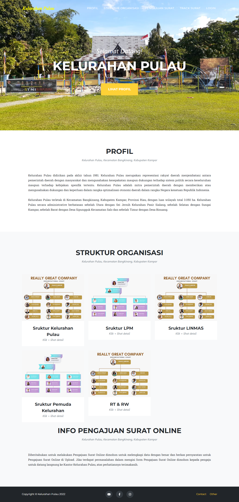
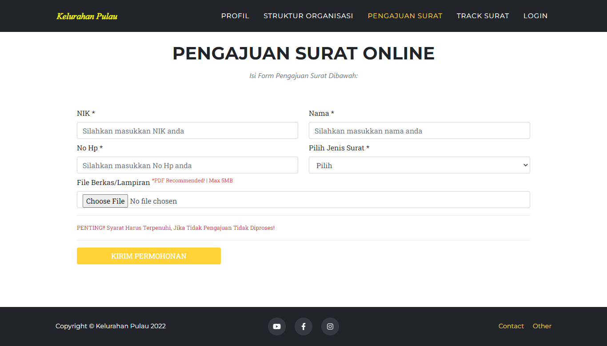
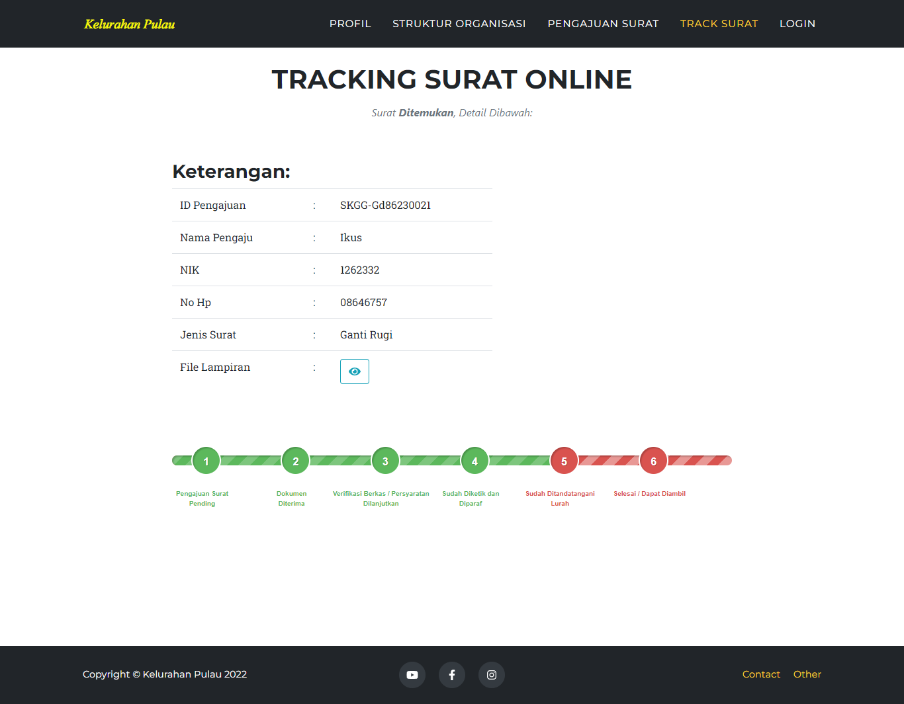
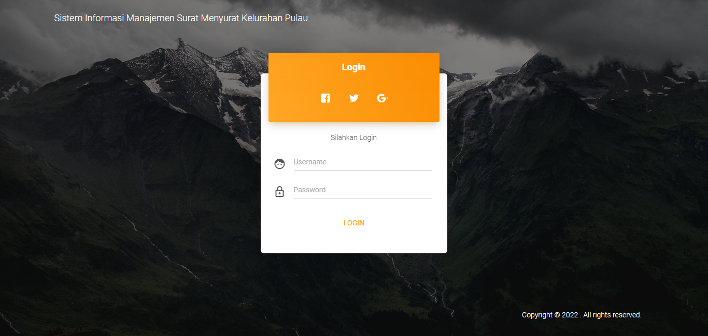
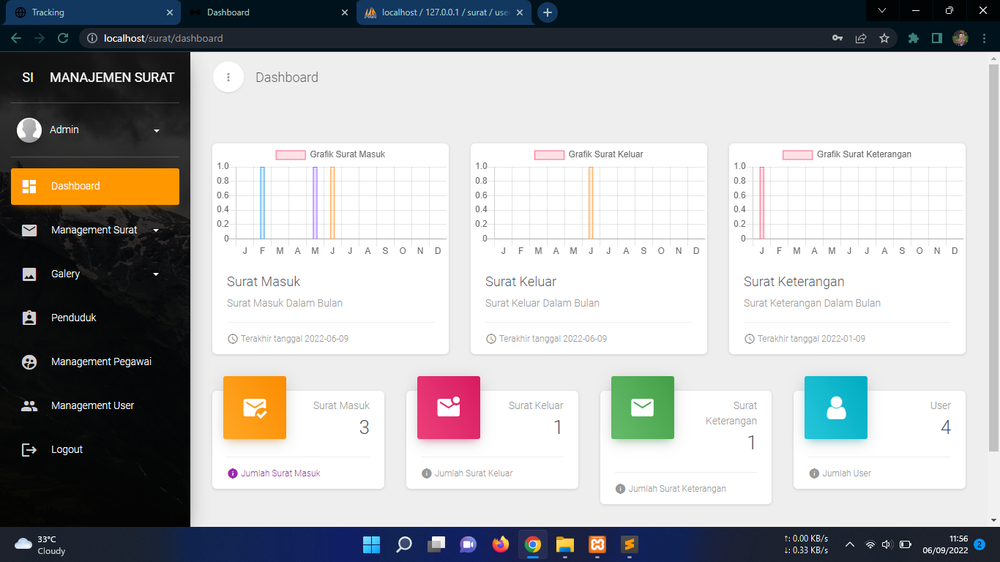

# Sistem Informasi Pengajuan Surat dan Monitoring Surat Menggunakan framework codeigniter
 Sistem Informasi Pengajuan Surat dan Monitoring Surat Menggunakan framework codeigniter ini memiliki tampilan yang sederhana dan fitur yang mampu berfungsi dengan baik.

To access admin page, add url /admin. Example http://localhost/surat/auth/login

## Tampilan Aplikasi

## Admin Account
|   Level   | Username | Password |
|:---------:|:--------:|---------:|
| Admin     |  admin   | admin    |
| Pegawai   |  pegawai | pegawai  |

## Sistem Requirement
- CodeIgniter
- Database MySQL
- XAMPP / PHP 5.6

